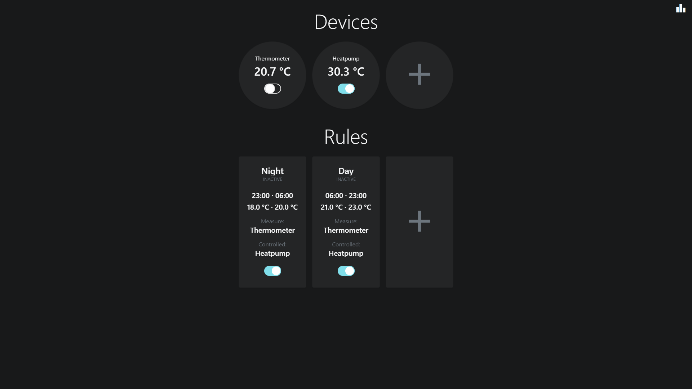
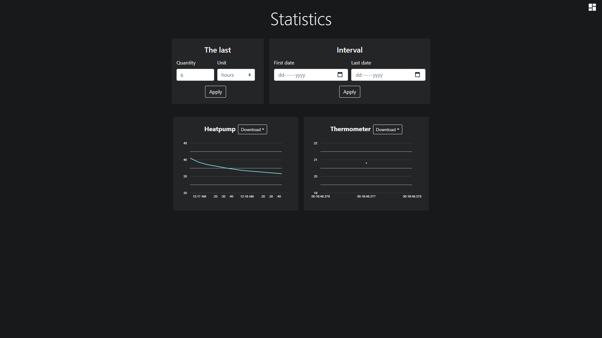
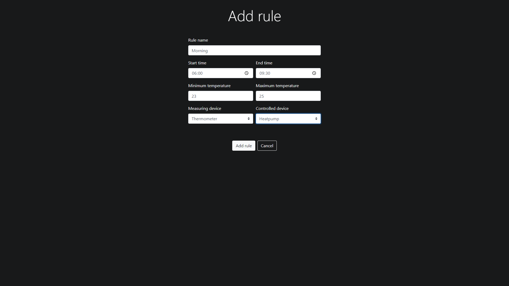

# Hidegvan (server)
Hidegvan is a [eWeLink](https://www.ewelink.cc/en/) based, real time, thermometer -> relay control software, with one person authentication.
## Available Scripts
Install: `npm install`

Run: `node app.js`

Build: `node builder.js`
## Description
[eWeLink](https://www.ewelink.cc/en/) authentication, and compatible devices (ex.: [SONOFF](https://sonoff.tech/)) required.

Before use, fill the **config/default.json** with your [eWeLink](https://www.ewelink.cc/en/) authentication data.

Required files after build: the executable, the **config** directory.
## Client
Directory **public/** contains the client application, built by [hidegvan-client](https://github.com/gregd98/hidegvan-client).
## Screenshots

